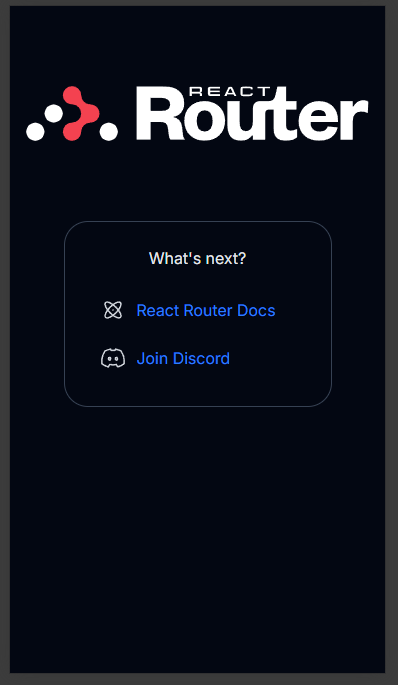
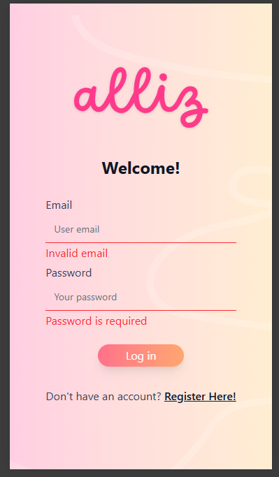
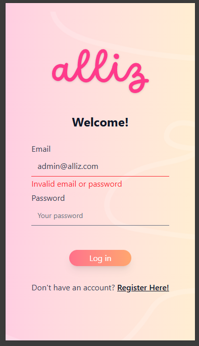

# Welcome to alliz! 👋

This is the interview repository. You can clone it before getting started. 😁

## Tech Stack

- Node.js v22.14
- TypeScript
- [Yarn](https://yarnpkg.com/)
- [Vite](https://vite.dev/)
- [React](https://react.dev/)
- [Tailwind CSS](https://tailwindcss.com/)
- [React Router 7 (Framework)](https://reactrouter.com/)

## How to set up the environment

We recommend using [VSCode](https://code.visualstudio.com/) with [WSL](https://code.visualstudio.com/docs/remote/wsl).

Install the following:

1. [Git](https://git-scm.com/)
2. [NVM](https://github.com/nvm-sh/nvm)
3. Node.js v22.14 (use NVM to install this version)

Using your IDE console, run:

1. Clone this repository using Git.
2. `corepack enable`
3. `yarn install`
4. `yarn dev`

If everything went well, you should see this page at [localhost](http://127.0.0.1:5173/) :

## Assessment

We’ll keep things straightforward so you don’t waste time!

Your objective is to implement a simple login form validation with authentication. You’ll be starting with some broken code — that’s intentional, and it serves as a hint for how you might fix it. 😉

**Bonus**: Redirect to the dashboard after a successful login.

### Rules

- You should **only** modify the `app/pages/LoginPage.tsx` file.
- Do **not** use Google or AI tools.
- You don’t need to change any styling.
- You can only use for resources:
    - [mdn](https://developer.mozilla.org/en-US/)
    - [React docs](https://react.dev/)
- You have **15 minutes**. 👍

### What we expect

Your implementation should:

- Validate the email format.
- Check if the password is missing.
- Confirm whether the email and password match the predefined values in the file.

The images below are for reference. Desktop mode is totally fine to use!

| **Invalid or missing password**              | **Invalid authentication**                    |
| -------------------------------------------- | --------------------------------------------- |
|  |  |

Happy coding! ✌️
